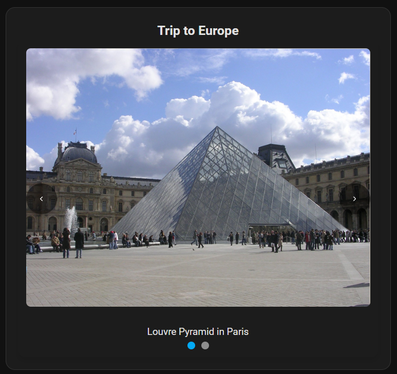
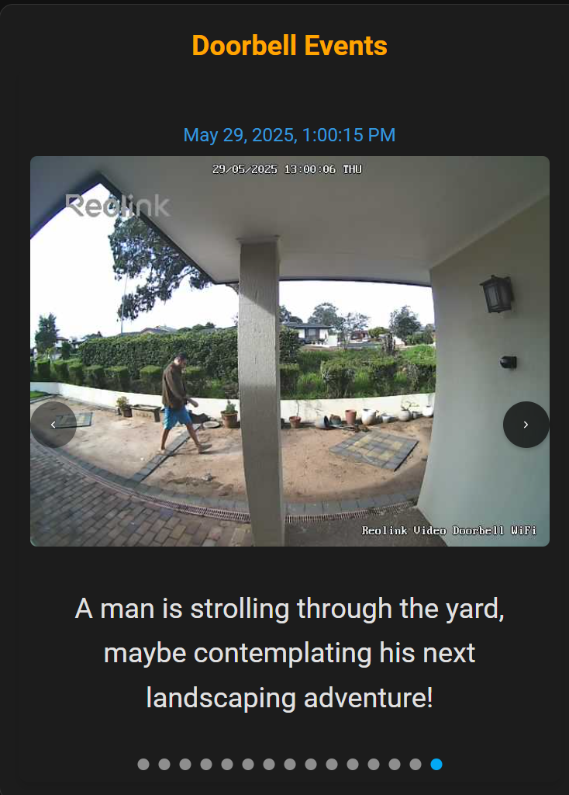

# 📸 Photo Carousel Card for Home Assistant

A highly customizable Lovelace card to display photo snapshots in a dynamic carousel, supporting local files, external JSON descriptions, and various styling options
---

## ✨ Features

- 📁 **Flexible Photo Sources**
  - Inline `photos` in the card config.
  - JSON file (`description_file.json`) with image paths and captions.
  

- 🔄 **Carousel Features**
  - Autoplay with adjustable delay.
  - Swipe support for mobile.
  - Pagination dots and arrow navigation.

- 🧠 **Smart Filtering**
  - `max_items_to_show`: Limit number of photos shown.
  - `max_days_to_show`: Filter photos based on age.

- 🎨 **Styling & Customization**
  - Show/hide timestamp.
  - Customize title, timestamp, and caption colors and fonts.

- 🖱️ **Intuitive Controls**
  - Arrows, dots, touch, and mouse dragging.

---

## 📦 Installation

### 🛠️ HACS Installation (Recommended)

[](https://my.home-assistant.io/redirect/hacs_repository/?repository=photo-carousel-card&category=plugin&owner=hammadbinarif)

1. Go to HACS > Frontend > "+ Explore & Download Repositories"
2. Paste this repository URL: `https://github.com/hammadbinarif/photo-carousel-card`
3. Choose **Lovelace** as category.
4. Install and refresh your browser.
5. Add it as a resource if not auto-added:


```yaml
resources:
  - url: /local/photo-carousel-card/photo-carousel-card.js
    type: module
```

### 🔧 Manual Installation
1. Download the latest `photo-carousel-card.js` from the [Releases](https://github.com/hammadbinarif/photo-carousel-card/releases).
2. Place it in `/config/www/photo-carousel-card/` on your Home Assistant instance.
3. Add the resource to your Lovelace configuration:


```yaml
resources:
  - url: /hacsfiles/photo-carousel-card/photo-carousel-card.js
    type: module
```

---

## ⚙️ Configuration

The Photo Carousel Card can be configured using the visual editor in Lovelace, or directly in YAML.

### Basic Card Options:
| Name                    | Type     | Required | Default          | Description                                                                 |
| :---------------------- | :------- | :------- | :--------------- | :-------------------------------------------------------------------------- |
| `type`                  | `string` | Yes      | `custom:photo-carousel-card` | The card type.                                                              |
| `title`                 | `string` | No       | `Photo Carousel` | The main title of the card.                                                 |
| `description_file_path` | `string` | No       |                  | Path to a `.txt` or `.json` file with photo details (e.g., `/local/events.json`). |
| `photos`                | `list`   | No       | `[]`             | A list of photo objects if defining them inline. (See example below).       |
| `autoplay`              | `number` | No       | `5000`           | Delay in milliseconds between slides (0 or `false` to disable).             |
| `reload_interval_minutes` | `number` | No     | `0`              | How often to reload the description file in minutes (0 to disable).         |
| `max_items_to_show`     | `number` | No       | `30`             | Maximum number of photos to display (0 for no limit).                       |
| `max_days_to_show`      | `number` | No       | `0`              | Only show photos from the last X days based on timestamp (0 for no limit).  |

### Styling Options:
Each style option (`title_style`, `timestamp_style`, `description_style`) is an `object` with the following sub-properties:

| Name         | Type      | Required | Default | Description                            |
| :----------- | :-------- | :------- | :------ | :------------------------------------- |
| `show_title` | `boolean` | No       | `true`  | Display the text (title, timestamp, or description). |
| `font_color` | `string`  | No       | `null`  | CSS color value (e.g., `red`, `#FF0000`, `var(--primary-color)`). |
| `font_size`  | `string`  | No       | `null`  | CSS font size (e.g., `24px`, `1.5em`, `large`). |

### Photo Data Sources:

You can provide photo data in two ways:

1.  **External JSON File (Recommended for large or dynamic data):**
    `description_file_path: /local/photos/events.json`
    The JSON file should be an array of objects:
    ```json
    [
        {
            "img": "/local/photos/image1.jpg",
            "desc": "This is a description for image 1.",
            "time_stamp": "2024-05-28T10:30:00Z"
        },
        {
            "img": "https://example.com/image2.png",
            "desc": "Another photo.",
            "time_stamp": "2024-05-27T15:00:00Z"
        }
    ]
    ```

2.  **Inline `photos` Array (For a few static photos):**
    ```yaml
    photos:
      - img: /local/my_static_photos/first_photo.jpg
        desc: "A beautiful static shot."
        time_stamp: "2024-01-01T12:00:00Z"
      - img: /local/my_static_photos/second_photo.png
        desc: "Another view."
        time_stamp: "2024-01-02T13:00:00Z"
    ```

## 💡 Examples

### Basic Configuration with inline photo config:

   ```yaml
    type: custom:photo-carousel-card
    title: Trip to Europe
    photos:
    - img: >-
        https://images.freeimages.com/images/large-previews/52b/pyramid-at-the-louvre-1226736.jpg
        desc: Louvre Pyramid in Paris
    - img: >-
        https://www.sprayedout.com/wp-content/uploads/2024/12/montjuic-national-palace-barcelona-web.jpg
        desc: Montjuic National Palace
   ```



### Custom styling options

   ```yaml
    type: custom:photo-carousel-card
    title: Doorbell Events
    description_file_path: /local/doorbell/doorbell_events.json
    autoplay: 10000
    reload_interval_minutes: 1
    max_items_to_show: 15
    max_days_to_show: 7
    title_style:
        show_title: true
        font_color: orange
        font_size: 24px
    timestamp_style:
        show_timestamp: true
        font_color: "#3498db"
        font_size: 16px
    description_style:
        show_description: true
        font_color: var(--text-color)
        font_size: 24px
   ```



---

## 🛠️ Troubleshooting
-   **Card not showing / `Custom element doesn't exist`:**
    -   Ensure the resource is correctly added in Lovelace resources (`/local/photo-carousel-card/photo-carousel-card.js` with type `JavaScript Module`).
    -   Clear your browser cache.
    -   Restart Home Assistant after installation.
-   **No photos appearing:**
    -   When using JSON file, Check your `description_file_path` for correctness. Ensure the files actually exist in `config/www/` (which maps to `/local/`).
    -   Verify the content of your `.txt` or `.json` file matches the expected format.
    -   Check `max_items_to_show` and `max_days_to_show` filters - they might be too restrictive.
    -   Open your browser's developer console (F12) and look for errors related to fetching files or JavaScript.

## 🙌 Contributing
PRs, issues, and suggestions welcome! Before submitting a PR, ensure you run the `build` command to compile the card for deployment.

---

## ⚠️ Notes
- Requires Home Assistant 2023.3 or newer.
- Ensure photo paths are accessible under `/local/`.

---

## 📃 License
MIT License © [Hammad Arif](https://github.com/hammadbinarif)